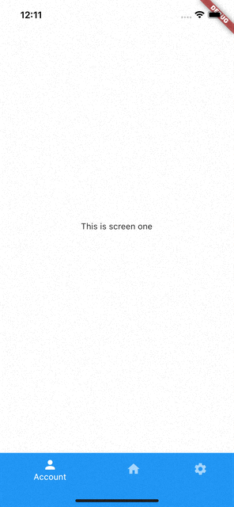

The easiest way to implement a bottom bar navigator in flutter.

## Features

Two incredible styles: Fixed (left) and Shifting (right).

<p float="left">
   
  
</p>

## Getting started

Add instant_bottom_bar dependency to your pubspec.yaml, right after the one for flutter.

```yaml
dependencies:
  flutter:
    sdk: flutter
  instant_bottom_bar:
    git:
      url: https://github.com/carlosvchrdevelop/flutter-instant-bottom-bar-pkg.git
```

## Usage

First of all, import de library.

```dart
import 'package:instant_bottom_bar/instant_bottom_bar.dart';
```

Now, you are ready to create the bottom bar. Let's see how to create shifting bottom bar from the screenshot above.

```dart
void main() {
  runApp(const MyApp());
}

class MyApp extends StatelessWidget {
  const MyApp({Key? key}) : super(key: key);
  @override
  Widget build(BuildContext context) {
    return const MaterialApp(
      title: 'Instant Bottom Bar demo',
      home: ShiftingBottomNavigationBar(
        selectedItColor: Colors.white,     // this is default value, you can ommit it
        unselectedItColor: Colors.white60, // this is default value, you can ommit it
        backgroundColor: Colors.blue,      // this is default value, you can ommit it
        tabs: [
          BottomNavigationTabData(
              icon: Icons.person,
              label: 'Account',
              widget: Center(child: Text('This is screen one'))),
          BottomNavigationTabData(
              icon: Icons.home,
              label: 'Home',
              widget: Center(child: Text('This is screen two'))),
          BottomNavigationTabData(
              icon: Icons.settings,
              label: 'Settings',
              widget: Center(child: Text('This is screen three')))
        ]
      ),
    );
  }
}
```

To create a bottom barwith the Fixed style, just follow the same previous steps, but replacing ShiftingBottomNavigationBar by FixedBottomNavigationBar.

## Additional information

You are free to use, share and edit this package if you find it useful. Enjoy it!

